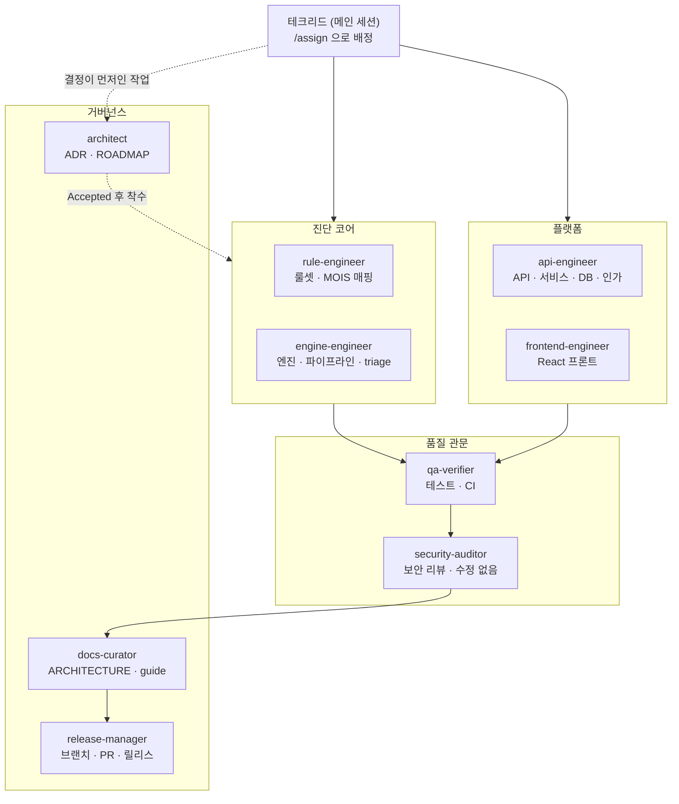

# OpenSAST 에이전트 개발조직

이 디렉터리는 OpenSAST 를 **Claude Code 에이전트 팀**으로 개발하기 위한 구성이다.
사람이 읽는 운영 규약은 이 문서, 에이전트가 읽는 규칙은 `../CLAUDE.md` 와
`rules/` 가 가진다.

> **성격**: Reference (항상 참) · **소유**: 저장소 전체 · **갱신 계기**: 조직·규약 변경

## 구성

```
.claude/
├── agents/     9개 에이전트 — 경로 기반 소유권
├── rules/      경로 스코프 규칙 — 해당 파일을 열 때만 컨텍스트에 붙는다
├── skills/     절차 — 호출될 때만 붙는다 (/assign /verify /mois-rule /adr /ship)
├── hooks/      불변식 강제 — 글이 아니라 코드로 막는다
└── settings.json  팀 공유 권한 + 훅 배선
```

**3계층으로 나눈 이유.** `CLAUDE.md` 는 매 세션 전량 로드되므로 토큰을 쓴다.
항상 참인 것만 거기 두고, 경로별 상세는 `rules/`(파일을 열 때 로드), 절차는
`skills/`(호출될 때 로드)로 내렸다. 어겼을 때 되돌리기 어려운 것만 `hooks/` 가
기계적으로 막는다 — 글로 적힌 규칙은 지켜질 수도, 안 지켜질 수도 있기 때문이다.

## 조직도



## 에이전트

| 에이전트 | 소유 경로 | 한 줄 임무 | 모델 |
|---|---|---|---|
| `rule-engineer` | `rules/**`, `opensast/mois/**` | 탐지 정확도. 메타데이터·픽스처 없는 룰은 룰이 아니다 | inherit |
| `engine-engineer` | `opensast/{engines,orchestrator,sarif,llm,reports}/**` | 스캔이 조용히 축소되지 않게 한다 | inherit |
| `api-engineer` | `opensast/{api,services,db}/**`, `config.py`, `alembic/**` | 인가 경계 수호. 조직 간 누출을 막는다 | **opus** |
| `frontend-engineer` | `frontend/**` | 결과를 정직하게 보여준다 | inherit |
| `qa-verifier` | `tests/**`, `.github/workflows/**` | "통과한다"를 "동작한다"로 만든다 | inherit |
| `security-auditor` | (읽기 전용) | 머지 전 마지막 관문. **코드를 고치지 않는다** | **opus** |
| `architect` | `docs/adr/**`, `docs/ROADMAP.md`, `docs/plan/**` | 왜 그렇게 했는지가 남게 한다 | **opus** |
| `docs-curator` | `docs/ARCHITECTURE.md`, `docs/guide/**`, 루트 문서 | 문서가 코드와 어긋나지 않게 한다 | inherit |
| `release-manager` | git · PR · 버전 | master 를 지킨다 | inherit |

`security-auditor` 는 `tools` 에 `Write`/`Edit` 가 없다. **구조적으로** 수정할 수
없으므로 리뷰의 독립성이 보장된다.

## 위임 규약

| 상황 | 결정권 | 반드시 참여 | 통보 |
|---|---|---|---|
| 룰 추가·튜닝 | `rule-engineer` | `qa-verifier` | `docs-curator` |
| 엔진 어댑터 변경 | `engine-engineer` | `qa-verifier`, `security-auditor` | `docs-curator` |
| **엔진 구성 변경** (Joern 도입, CodeQL 제거) | **`architect` (ADR 선행)** | `engine-engineer` | 전원 |
| 라우트·서비스·스키마 | `api-engineer` | `security-auditor`, `qa-verifier` | `docs-curator` |
| 프론트 화면 | `frontend-engineer` | `qa-verifier` | — |
| CI 게이트 승격 | `qa-verifier` | `release-manager` | 전원 |
| 릴리스 | `release-manager` | `architect`(ROADMAP), `docs-curator`(changelog) | 전원 |

**원칙 4가지**

1. **한 작업에 한 담당.** 두 영역에 걸치면 작업을 쪼갠다.
2. **결정 → 구현 → 검증 → 리뷰 → 문서 → 릴리스.** 순서를 건너뛰지 않는다.
3. **`security-auditor` 는 항상 태운다.** 지적 사항은 원래 담당에게 되돌린다.
4. **동작이 바뀌면 `docs-curator` 가 빠질 수 없다** (ADR-0007).

## 스킬

| 명령 | 자동 호출 | 용도 |
|---|---|---|
| `/assign <작업>` | 수동만 | 담당 배정 · 착수 계획 · 관문 |
| `/verify [full\|quick\|self-scan]` | 가능 | CI 동등 로컬 검증 |
| `/mois-rule <SR항목>` | `rules/**` 작업 시 자동 | MOIS 탐지 룰 작성 절차 |
| `/adr <주제>` | 가능 | ADR 작성 · 상태 전환 |
| `/ship <주제>` | 수동만 | 브랜치 → PR → squash merge |

`/ship` 과 `/assign` 은 `disable-model-invocation: true` 다 — 부수효과가 있거나
사람이 시점을 정해야 하는 절차이므로 Claude 가 스스로 실행하지 않는다.

## 훅 (기계적 강제)

| 훅 | 이벤트 | 막는 것 |
|---|---|---|
| `protect-invariants.py` | `PreToolUse` (Edit/Write) | **차단**: `tests/vulnerable-samples/`, `tests/test_engine_integration.py`, `alembic/versions/0001*`, `.env` 수정<br>**확인**: `docs/reviews/`(동결), `docs/adr/NNNN-*.md` 수정 |
| `protect-git.py` | `PreToolUse` (Bash) | master/main 직접 커밋·푸시, `--force` 푸시 |

둘 다 **fail-open** 이다. 훅 자체의 오류가 작업을 막지 않는다.
`python3` 만 있으면 되고 `jq` 는 필요 없다.

`settings.json` 의 `permissions.deny` 는 `.env` 읽기, `--force` 푸시,
`docker compose down -v`(볼륨 삭제), `rm -rf` 를 막는다.

## 사용법

```bash
claude                                  # 저장소 루트에서
/assign 스캔 취소 API 를 만들고 싶다      # 배정안부터 받는다
```

에이전트를 직접 지목할 수도 있다: *"api-engineer 로 findings 라우트의 조직
스코핑을 점검해줘"*.

작업이 끝나면 `/verify` → `security-auditor` 리뷰 → `/ship` 순으로 간다.

## 유지보수

- **에이전트 추가**: `agents/<이름>.md` 에 `name`·`description` 필수. `description`
  이 위임 판단의 근거이므로 **언제 쓰는지**를 구체적으로 쓴다.
- **모델 조정**: 각 에이전트의 `model:` 을 `inherit`/`sonnet`/`opus` 로 바꾼다.
  기본은 `inherit`(세션 모델)이고, 인가 경계·보안 리뷰·설계 결정 셋만 `opus` 다.
- **규칙 추가**: 경로별이면 `rules/<주제>.md` 에 `paths:` 프론트매터로. 매 세션
  필요하면 `../CLAUDE.md` 에 — 다만 **200줄 이하**를 유지한다.
- **절차 추가**: `skills/<이름>/SKILL.md`. 부수효과가 있으면
  `disable-model-invocation: true`.
- 개인 설정은 `settings.local.json`(git 무시)에, 팀 공유는 `settings.json` 에.

## 관련 문서

`../CLAUDE.md` (에이전트용 요약) · `../CONTRIBUTING.md` (사람 기여자용) ·
`../docs/README.md` (문서 색인) · `../docs/adr/README.md` (결정 이력)
